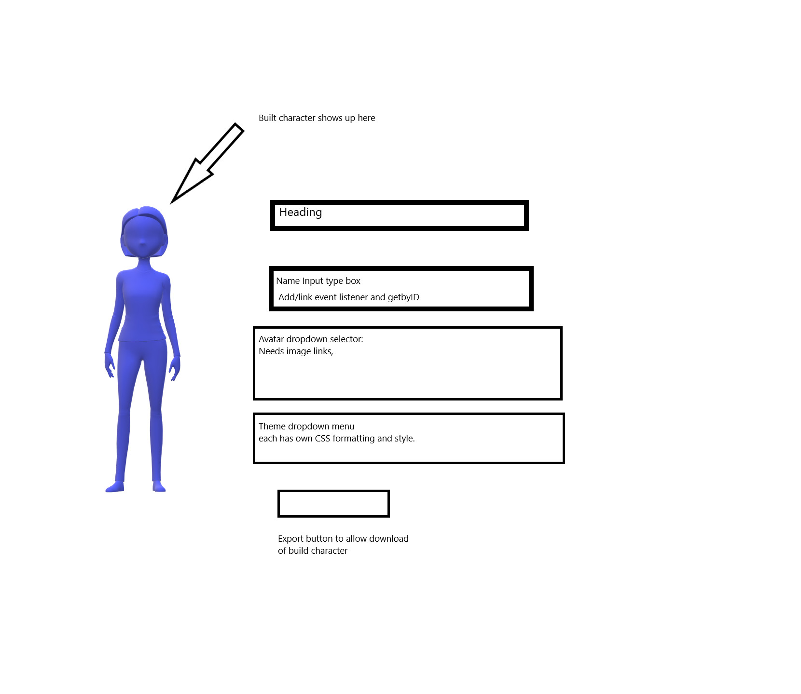

##List of State and Events:

1. Create Heading
2. Create Name input box. Will need to associate addeventlistener and getbyID
3. Create a dropdown that allows you to choose avatar for your character. Unique image associated with each avatar.
4. Create typeare that allows user to type a description of their character that shows up in avatar image area.
5. Create a dropdown box that allows user to pick a theme for their character. Each theme will have its own CSS properties.*learn how to overlay 2 images?*
6. Create a button that allows user to download a copy of their finished character.

## The Golden Rule:

🦸 🦸‍♂️ `Stop starting and start finishing.` 🏁

1. Limit Work in Progress (WIP)
1. Validate each line of code before moving forward
1. Keep it Simple Simon (KISS)

## Making a plan

1. Make a drawing of your app. **Simple "wireframes"**
1. Once you have a drawing, **name the HTML elements** you'll need to realize your vision**
1. For each HTML element ask: **Why do I need this?**
    - Does this element need **static content**, or is the content **dynamic state**?
    - If **state** where is the source of truth?
1. **Find all the 'events'** (user clicks, form submit, on load etc) in your app. Ask one by one, "What happens when" for each of these events. Does any state change?
1. Once we know the _why_ of elements, state, and events -- think about how to implement the "Why" as a "How"
1. Think about how to **validate each of your features** according to a Definition of Done
1. Consider what features **_depend_ on what other features**. Use this dependency logic to figure out what order to complete tasks.
